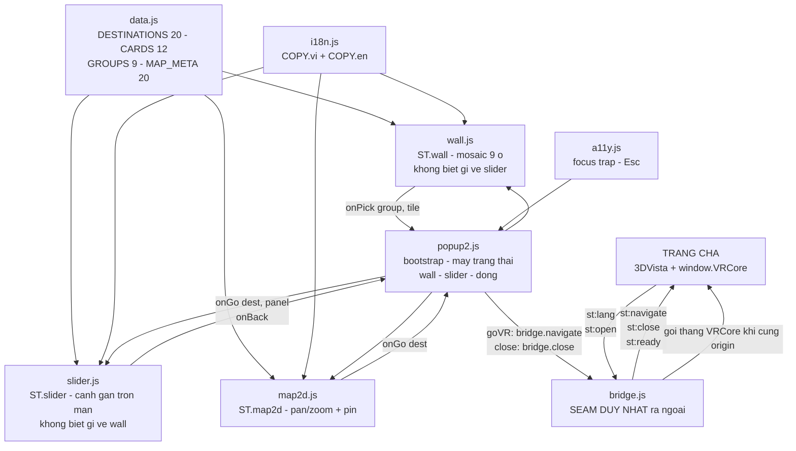

> Cập nhật: 2026-08-05 (v16 — D-62: dải chip cuộn ngang bằng chuột do JS lo. v15 — D-61:
> nền sáng + thẻ thành mặc định ở `css/slider.css`, nút bản đồ 2D trở lại wall)

# 01 — Architecture & Structure

## 1.1 Cây thư mục

```
suoitien-vr360redes/
├── CLAUDE.md                  # Rules — đọc trước khi sửa gì
├── index.html                 # ★ DELIVERABLE DUY NHẤT — VR Wall + Infinite Slider
├── note.md                    # Ý tưởng gốc của bố cục này (§137). Không phải docs.
├── Ban Do Suoi Tien/          # Ảnh bản đồ GỐC khách gửi (39 MB) — nguồn, đừng deploy
├── docs/                      # ← bạn đang ở đây
│
├── css/
│   ├── tokens.css             # ⟨chung⟩ màu, font, spacing, z-index, easing
│   ├── base.css               # ⟨chung⟩ reset, html/body TRONG SUỐT, img cover, #st-debug
│   ├── map2d.css              # #st-map — bản đồ 2D + pin (D-51)
│   ├── wall.css               # #st-pop2 + mosaic 9 ô — bố cục DESKTOP
│   ├── slider.css             # .st-sld-* — thẻ ngang trên nền trắng (D-61)
│   └── responsive2.css        # ⭐ TOÀN BỘ @media, nạp CUỐI (kể cả @media của bản đồ)
│
├── js/
│   ├── data.js                # DESTINATIONS (20), CARDS (12), GROUPS (9), CATEGORIES
│   ├── i18n.js                # COPY.vi + COPY.en · quét [data-i18n|-aria|-ph]
│   ├── a11y.js                # focus trap + Esc (đã trim — xem §1.4)
│   ├── bridge.js              # ★ SEAM DUY NHẤT ra trang cha
│   ├── map2d.js               # ST.map2d — bản đồ 2D pan/zoom + pin lọc (D-51)
│   ├── wall.js                # ST.wall — mosaic 9 ô cảnh động
│   ├── slider.js              # ST.slider — cảnh gần trọn màn + lọc/tìm
│   └── popup2.js              # bootstrap + máy trạng thái. Nạp CUỐI.
│
├── assets/
│   ├── img/cards/*.webp       # 12 ảnh banner 3:2, 500–1200px (~1,32 MB)
│   │                          #   Nguồn suoitien.vn — URL gốc ở 06-data.md §6.8
│   └── map/park-2400.webp     # Bản đồ 2D 2400×1208 (391 KB), đã flatten #0f172a
│                              #   Nguồn `Ban Do Suoi Tien/` — 06-data.md §6.10
│
└── tools/                     # CÔNG CỤ DEV — không thuộc bản chạy
    ├── check-icon-center.js   # Tâm khối của từng symbol (cô lập)
    ├── check-icon-rendered.js # Pixel THẬT đã render — bắt lỗi do CSS
    └── check-image-cover.js   # ⭐ Mọi ảnh PHỦ có trùm kín khung cha không (D-53)
```

> Cả 3 tool cần `playwright` (`npm i -D playwright`). Đây là **công cụ dev**, bản chạy
> vẫn là HTML/CSS/JS thuần không npm — RULE #3 không bị vi phạm.
>
> **Chạy `check-image-cover.js` sau mỗi lần sửa CSS ảnh.** Nó đo hình học đã render;
> kiểm `object-fit: cover` bằng mắt hoặc bằng `getComputedStyle` KHÔNG bắt được lớp
> lỗi này (D-53).

### File đã bị gỡ (2026-08-03 · D-46)

Toàn bộ phần "trang VR" đã xoá vì project chỉ còn cái popup:

| Gỡ | Từng làm gì |
|---|---|
| `css/navbar.css` · `js/navbar.js` | Topbar + navbar 84 mục + drawer mobile (YC-3) |
| `css/viewer.css` · `js/viewer.js` | Panorama mock + drag để pan |
| `css/controls.css` · `js/controls.js` | Cụm C 2 nút + thẻ vé combo |
| `css/route.css` · `js/route.js` | M2 overlay chỉ đường (D-43) |
| `css/places.css` · `js/places.js` | M3 overlay danh sách điểm đến (D-43) |
| `css/ticket.css` | Thẻ vé combo (D-41) |
| `css/scope.css` | Cờ thu phạm vi (D-39) — hết lý do khi phạm vi chỉ còn 1 thứ |
| `css/overlays.css` · `js/overlays.js` | Engine mở-đóng dùng chung cho nhiều modal |
| `js/store.js` | State tập trung + pub/sub |
| `js/app.js` | Bootstrap |
| `js/welcome.js` | Modal welcome |
| `tools/fa-extract.js` | Trích icon FontAwesome cho topbar |

Bốn file `overlays.js` · `store.js` · `app.js` · `welcome.js` **gộp thành một**
`js/popup.js`: khi chỉ còn MỘT popup thì engine mở-đóng dùng chung, bộ điều phối
nhiều modal và pub/sub đều mất lý do tồn tại.

Mọi thứ vẫn khôi phục được bằng `git show 9e5d46e:<đường-dẫn>`.

### Vì sao sprite icon inline, còn ảnh để file rời

**SVG sprite** nằm inline trong `index.html`: `fetch()` / `<use href="file.svg#id">`
đều **bị CORS chặn khi mở `file://`** → double-click `index.html` sẽ thấy trang không
có icon. Inline là cách duy nhất chạy được cả `file://` lẫn `http://`.
Sprite còn **12 icon** (bản trước 68), tất cả đều đang được dùng.

**Ảnh điểm đến** thì ngược lại, để rời trong `assets/img/cards/`: ``
không bị CORS chặn (khác `fetch`), và nhúng 12 ảnh base64 sẽ thổi `index.html` lên
~1,3 MB.

**Không hotlink** về `suoitien.vn` (RULE #3): popup phải xem được khi không có mạng,
và ảnh gốc có tấm nặng 17 MB.

### ⚫ Từng có HAI bản song song (D-50) — còn một (D-57 · 2026-08-04)

Từ 2026-08-03 tới 2026-08-04 project có `index.html` (màn chào + 3D carousel) và
`index2.html` (VR Wall + Slider) chạy song song để khách chọn. **Khách chọn bản
Wall + Slider**; bản 1 và 5 file riêng của nó đã bị gỡ, `index2.html` chép về thành
`index.html`. Spec đầy đủ: [`09-variant2.md`](09-variant2.md).

### Vì sao vẫn còn hậu tố "2" trong tên

`#st-pop2` · `.st-p2-*` · `js/popup2.js` · `css/responsive2.css` · `docs/09-variant2.md`
giữ nguyên tên là **cố ý**, không phải quên dọn.

Tên `#st-popup` / `js/popup.js` / `css/responsive.css` vừa mới thuộc về bản 1, và
`08-decisions.md` nhắc tới chúng ở ~40 chỗ (D-44 → D-56). Tái sử dụng tên sẽ làm 40 mục
lịch sử lặng lẽ nói sai — người đọc sau sẽ tưởng D-49 ("carousel còn 3 thẻ") đang mô tả
`#st-popup` hiện tại. Giá của việc giữ tên là mấy dòng chú thích; giá của việc đổi tên
là một cuốn sử không đọc được. Xem D-57.

### File đã bị gỡ (2026-08-04 · D-57)

| Gỡ | Từng làm gì |
|---|---|
| `css/carousel.css` · `js/carousel.js` | 3D coverflow của bản 1 (D-44 · D-49 · D-55) |
| `css/popup.css` · `js/popup.js` | Khung toàn màn + 3 trạng thái của bản 1 |
| `css/responsive.css` | @media của bản 1 |
| `host-demo.html` | Trang cha mô phỏng — xem D-57, sẽ dựng lại lúc bàn giao |

Khôi phục được bằng `git show 3be9e22:<đường-dẫn>` (`host-demo.html` bản thật ở đúng
commit đó; ở `0cb4c67` nó đã bị ghi đè bằng markup bản 1).

## 1.2 Nguyên tắc kiến trúc

| Nguyên tắc | Lý do |
|---|---|
| **Popup không biết mình ở trong iframe** | Chỉ `js/bridge.js` biết. Muốn nhúng vào chỗ khác thì chỉ phải đọc lại 1 file. |
| **Không dependency ngoài** | Khách mở file là chạy, không cần mạng. Không CDN, không npm. |
| **Prefix `st-` cho mọi id/class** | Trong iframe thì CSS đã cách ly sẵn, nhưng prefix vẫn giúp grep và giúp nếu sau này ai đó nhúng inline thay vì iframe. |
| **1 file CSS = 1 vùng UI** | Sửa wall không cần mở file khác. Ngoại lệ có chủ ý: `responsive2.css` giữ @media của MỌI vùng — xem §1.3. |
| **`html, body` trong suốt** | Bắt buộc dù popup có nền đặc: lúc vào/ra nó fade `opacity`, đúng những frame đó phải nhìn xuyên qua thấy panorama. [`07`](07-integration.md) §7.2.1. |
| **Mọi mock đánh dấu `// MOCK:`** | Dev port sang bản thật chỉ cần grep `MOCK:` là ra hết chỗ cần nối API. |

## 1.3 Thứ tự load trong `index.html`

`tokens.css` phải trước mọi CSS khác; `responsive2.css` phải **sau cùng**;
`data.js` phải trước mọi JS khác; `popup2.js` phải **cuối cùng**.

```html
<head>
  <!-- Google Fonts (ngoại lệ RULE #3 đang tồn tại — xem TODO.md) -->
  tokens.css → base.css → wall.css → slider.css → map2d.css → responsive2.css
</head>
<body>
  <!-- SVG sprite inline (12 icon) — phải có TRƯỚC mọi <use> -->
  <svg id="st-icons">…</svg>

  <!-- Markup: #st-pop2 > .st-brandline + .st-p2-close
                        + section.st-wall + section.st-sld
               #st-map  (anh em của #st-pop2, không nằm trong) -->

  data.js → i18n.js → a11y.js → bridge.js → map2d.js → wall.js → slider.js → popup2.js
</body>
```

`responsive2.css` nạp CUỐI là **ràng buộc**, không phải quy ước: từ D-58 nó giữ toàn
bộ @media của project, kể cả của bản đồ 2D — nó phải thắng `map2d.css` bằng thứ tự
nguồn chứ không bằng specificity.

Tất cả `<script>` là **classic script** (không `type="module"`) → biến global, không
cần server, mở `file://` chạy được. Mỗi file bọc trong IIFE, chỉ expose 1 namespace:
`ST.data`, `ST.i18n`, `ST.a11y`, `ST.bridge`, `ST.map2d`, `ST.wall`, `ST.slider`,
`ST.popup2`.

> `wall.js` · `slider.js` · `map2d.js` và `bridge.js` phải nạp **trước** `popup2.js` —
> bootstrap gọi thẳng `.create()` và `ST.bridge.on()` ngay trong lượt chạy đầu.

## 1.4 `a11y.js` đã trim những gì và vì sao

| Bỏ | Vì sao không dùng được trong iframe |
|---|---|
| `lockScroll` / `unlockScroll` | `body` của popup vốn đã `overflow: hidden`. Còn cuộn của **trang cha** thì popup không với tới được (khác document). |
| `rememberFocus` / `restoreFocus` | Focus trước khi popup mở nằm ở document cha; `document.activeElement` trong đây không nhìn thấy nó. |
| `roving()` | Từng dùng cho hotspot trên bản đồ. `slider.js` tự quản tabindex (chỉ nút "Khám phá" của cảnh giữa vào được bằng Tab). |

Hai việc đầu chuyển thành **trách nhiệm của trang cha** —
[`07-integration.md`](07-integration.md) §7.3.

Giữ lại: `trap()` (bẫy Tab — không có nó thì Tab ở thẻ cuối nhảy ra khỏi iframe, người
dùng bàn phím mất dấu popup) và `onEsc()`.

## 1.5 Bảng z-index (nguồn duy nhất: `tokens.css`)

Thang **thấp** (10–30) và đó là **đúng**: popup nằm trong document riêng nên không
tranh chấp với 3DVista hay `floorplan.css` (chiếm 10000–10009). Con số duy nhất phải
đặt cao nằm ở trang cha, trên chính thẻ `<iframe>` —
[`07-integration.md`](07-integration.md) §7.4.

| Token | Giá trị | Dùng cho |
|---|---|---|
| `--st-z-popup` | `10` | `#st-pop2` |
| `--st-z-map` | `15` | `#st-map` — phủ lên popup, cùng document nên chỉ cần >10 |
| `--st-z-toast` | `20` | *(dự phòng, chưa dùng)* |
| `--st-z-debug` | `30` | `#st-debug` (`?debug=1`) |

Bên trong `#st-pop2` còn vài `z-index` cục bộ — `.st-brandline` và `.st-p2-close: 60`,
`.st-p2-gate: 55`, `.st-sld-nav: 30`, `.st-sld-top`/`.st-sld-bot: 20`,
`.st-sld-stage: 10`, panel slider `50 − |offset|` do JS gán, và từ D-58 thêm
`.st-wall-bar: 10` (thanh dính đáy phải nằm trên ô đang trôi qua dưới nó). Chúng nằm
trong stacking context của `#st-pop2` nên không rò ra ngoài.

## 1.6 Sơ đồ phụ thuộc module



Quy tắc phụ thuộc: **`bridge.js` là phần tử duy nhất chạm ra ngoài.** Ba component
(`wall` · `slider` · `map2d`) không biết nhau và không biết `popup2.js` tồn tại — chúng
nhận callback. `popup2.js` không biết `postMessage` tồn tại — nó gọi `ST.bridge`.

Một chỗ **cố ý phá** quy tắc "component không chạm DOM ngoài mình": `map2d.js:showCard()`
ghi `--st-card-h` lên chính `#st-map` (gốc của nó) để `responsive2.css` biết bottom
sheet cao bao nhiêu mà đẩy cụm nút zoom lên. CSS không tự đo được chiều cao một phần tử
khác; xem D-58(h).

## 1.7 File nào sửa khi muốn đổi gì

| Muốn đổi | Sửa file |
|---|---|
| Màu / font / spacing / radius / shadow | `css/tokens.css` — **chỉ** file này |
| Tên điểm, danh sách điểm, ảnh | `js/data.js` → `DESTINATIONS` / `CARDS` |
| Số hiệu / vị trí pin trên bản đồ | `js/data.js` → `MAP_META` |
| Ảnh bản đồ | `js/data.js` → `MAP` + `assets/map/` (nhớ flatten, xem `06-data.md` §6.10) |
| Chữ trên UI (tiêu đề, label nút, badge) | `js/i18n.js` → object `COPY` |
| Message trao đổi với trang cha | `js/bridge.js` + docs `07-integration.md` §7.5 |
| Nhịp ô wall tự đổi cảnh | `js/wall.js` → `SWAP_MS` / `SWAP_STAGGER` |
| Số ảnh nạp mỗi ô | `js/wall.js` → `imgsPerTile()` (mobile 2, desktop 3 · D-58) |
| Tốc độ tự chạy của slider | `js/slider.js` → `AUTO_MS` (desktop) / `AUTO_MS_SM` (điện thoại, D-60) — và transition 620ms ở `css/slider.css`, 460ms ở `css/responsive2.css` |
| Bố cục THẺ của slider (mọi khổ) | `css/slider.css` = thẻ NGANG mặc định · `css/responsive2.css` `@media (orientation: portrait)` = thẻ DỌC. Nhịp 2,5s bám `SMALL_MQ` trong `js/slider.js` (D-61) |
| Lối vào bản đồ 2D | `index.html` — bất kỳ nút nào mang `data-open-map="all" \| "area"`; không phải sửa JS (D-61) |
| Cách cuộn dải chip lọc nhóm | `js/slider.js` → khối `── Dải chip ──` trong `bind()` (`wheel` + kéo bằng chuột) · `centerChip()` · `updFade()` — CSS chỉ mở `overflow-x`, không mở đường vào (D-62) |
| **Layout mobile / tablet / landscape** | `css/responsive2.css` — **chỉ** file này (D-58) |
| Cách chia 9 khu vực | `js/data.js` → `GROUPS` (`size` + `cover` + `keys`) |
| Bố cục mosaic desktop | thứ tự trong `GROUPS` + `grid-template-rows` ở `css/wall.css` |
| Bố cục mosaic mobile | `aspect-ratio` của `.st-s-lg` / `.st-s-md` / `.st-s-sm` ở `css/responsive2.css` |
| **Khi nào popup hiện ra** | Không sửa ở đây — trang cha quyết, xem `07-integration.md` §7.9 |
