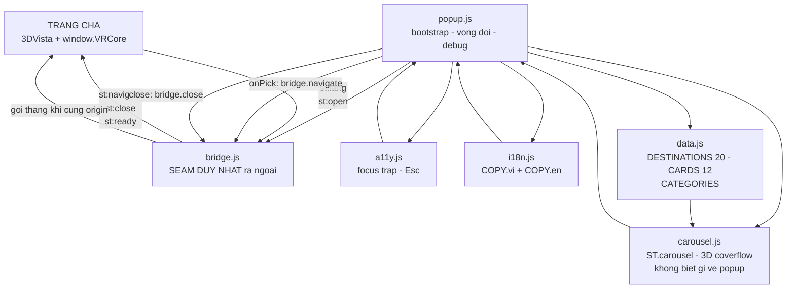

> Cập nhật: 2026-08-03 (v12 — thêm tools/check-image-cover.js · D-53)

# 01 — Architecture & Structure

## 1.1 Cây thư mục

```
suoitien-vr360redes/
├── CLAUDE.md                  # Rules — đọc trước khi sửa gì
├── index.html                 # ★ BẢN 1 — màn chào + 3D carousel
├── index2.html                # ★ BẢN 2 — VR Wall + Infinite Slider (D-50)
├── host-demo.html             # Trang cha MÔ PHỎNG — DEV ONLY, đừng deploy
├── note.md                    # Ý tưởng gốc của bản 2 (§137). Không phải docs.
├── Ban Do Suoi Tien/          # Ảnh bản đồ GỐC khách gửi (39 MB) — nguồn, đừng deploy
├── docs/                      # ← bạn đang ở đây
│
├── css/
│   ├── tokens.css             # ⟨chung⟩ màu, font, spacing, z-index, easing
│   ├── base.css               # ⟨chung⟩ reset, html/body TRONG SUỐT, img cover, #st-debug
│   ├── map2d.css              # ⟨chung⟩ #st-map — bản đồ 2D + pin (D-51)
│   ├── carousel.css           # ⟨bản 1⟩ .st-cr-* — hình học 3D coverflow (D-44)
│   ├── popup.css              # ⟨bản 1⟩ #st-popup — khung toàn màn
│   ├── responsive.css         # ⟨bản 1⟩ @media, nạp cuối
│   ├── wall.css               # ⟨bản 2⟩ #st-pop2 + mosaic 9 ô
│   ├── slider.css             # ⟨bản 2⟩ .st-sld-* — cảnh gần trọn màn
│   └── responsive2.css        # ⟨bản 2⟩ @media, nạp cuối
│
├── js/
│   ├── data.js                # ⟨chung⟩ DESTINATIONS (20), CARDS (12), GROUPS (9), CATEGORIES
│   ├── i18n.js                # ⟨chung⟩ COPY.vi + COPY.en · quét [data-i18n|-aria|-ph]
│   ├── a11y.js                # ⟨chung⟩ focus trap + Esc (đã trim — xem §1.4)
│   ├── bridge.js              # ⟨chung⟩ ★ SEAM DUY NHẤT ra trang cha
│   ├── map2d.js               # ⟨chung⟩ ST.map2d — bản đồ 2D pan/zoom + pin lọc (D-51)
│   ├── carousel.js            # ⟨bản 1⟩ ST.carousel — 3D coverflow
│   ├── popup.js               # ⟨bản 1⟩ bootstrap + 3 trạng thái (deck/list/map). Nạp CUỐI.
│   ├── wall.js                # ⟨bản 2⟩ ST.wall — mosaic 9 ô cảnh động
│   ├── slider.js              # ⟨bản 2⟩ ST.slider — cảnh gần trọn màn + lọc/tìm
│   └── popup2.js              # ⟨bản 2⟩ bootstrap + máy trạng thái. Nạp CUỐI.
│
├── assets/
│   ├── img/cards/*.webp       # 12 ảnh banner 760×507 (~930 KB tổng)
│   │                          #   Nguồn suoitien.vn — URL gốc ở 06-data.md §6.8
│   └── map/park-2400.webp     # Bản đồ 2D 2400×1208 (391 KB), đã flatten #0f172a
│                              #   Nguồn `Ban Do Suoi Tien/` — 06-data.md §6.10
│
└── tools/                     # CÔNG CỤ DEV — không thuộc bản chạy
    ├── check-icon-center.js   # Tâm khối của từng symbol (cô lập)
    ├── check-icon-rendered.js # Pixel THẬT đã render — bắt lỗi do CSS
    └── check-image-cover.js   # ⭐ Mọi ảnh PHỦ có trùm kín khung cha không (D-53)
```

> Cả 3 tool cần `playwright` (`npm i -D playwright`). Đây là **công cụ dev**, bản chạy
> vẫn là HTML/CSS/JS thuần không npm — RULE #3 không bị vi phạm.
>
> **Chạy `check-image-cover.js` sau mỗi lần sửa CSS ảnh.** Nó đo hình học đã render;
> kiểm `object-fit: cover` bằng mắt hoặc bằng `getComputedStyle` KHÔNG bắt được lớp
> lỗi này (D-53).

### File đã bị gỡ (2026-08-03 · D-46)

Toàn bộ phần "trang VR" đã xoá vì project chỉ còn cái popup:

| Gỡ | Từng làm gì |
|---|---|
| `css/navbar.css` · `js/navbar.js` | Topbar + navbar 84 mục + drawer mobile (YC-3) |
| `css/viewer.css` · `js/viewer.js` | Panorama mock + drag để pan |
| `css/controls.css` · `js/controls.js` | Cụm C 2 nút + thẻ vé combo |
| `css/route.css` · `js/route.js` | M2 overlay chỉ đường (D-43) |
| `css/places.css` · `js/places.js` | M3 overlay danh sách điểm đến (D-43) |
| `css/ticket.css` | Thẻ vé combo (D-41) |
| `css/scope.css` | Cờ thu phạm vi (D-39) — hết lý do khi phạm vi chỉ còn 1 thứ |
| `css/overlays.css` · `js/overlays.js` | Engine mở-đóng dùng chung cho nhiều modal |
| `js/store.js` | State tập trung + pub/sub |
| `js/app.js` | Bootstrap |
| `js/welcome.js` | Modal welcome |
| `tools/fa-extract.js` | Trích icon FontAwesome cho topbar |

Bốn file `overlays.js` · `store.js` · `app.js` · `welcome.js` **gộp thành một**
`js/popup.js`: khi chỉ còn MỘT popup thì engine mở-đóng dùng chung, bộ điều phối
nhiều modal và pub/sub đều mất lý do tồn tại.

Mọi thứ vẫn khôi phục được bằng `git show 9e5d46e:<đường-dẫn>`.

### Vì sao sprite icon inline, còn ảnh carousel để file rời

**SVG sprite** nằm inline trong `index.html`: `fetch()` / `<use href="file.svg#id">`
đều **bị CORS chặn khi mở `file://`** → double-click `index.html` sẽ thấy trang không
có icon. Inline là cách duy nhất chạy được cả `file://` lẫn `http://`.
Sprite còn **5 icon** (bản trước 68) — popup không dùng gì thêm.

**Ảnh carousel** thì ngược lại, để rời trong `assets/img/cards/`: ``
không bị CORS chặn (khác `fetch`), và nhúng 12 ảnh base64 sẽ thổi `index.html` lên
~1,3 MB.

**Không hotlink** về `suoitien.vn` (RULE #3): popup phải xem được khi không có mạng,
và ảnh gốc có tấm nặng 17 MB.

### Hai bản song song (D-50)

`index.html` và `index2.html` là **hai ý tưởng thiết kế khác nhau** để khách chọn,
không phải hai phiên bản của một thứ. Chúng dùng chung 4 file JS + 2 file CSS; phần
riêng đánh dấu ⟨bản 1⟩ / ⟨bản 2⟩ ở cây trên.

Quan trọng nhất: **dùng chung `bridge.js`** → trang cha đổi bản chỉ là đổi `src` của
iframe, không sửa một dòng nào. Spec bản 2: [`09-variant2.md`](09-variant2.md).

> Sửa `data.js` / `i18n.js` / `a11y.js` / `bridge.js` là **đụng vào cả hai bản** —
> chạy lại test của cả hai trước khi coi là xong.

## 1.2 Nguyên tắc kiến trúc

| Nguyên tắc | Lý do |
|---|---|
| **Popup không biết mình ở trong iframe** | Chỉ `js/bridge.js` biết. Muốn nhúng vào chỗ khác thì chỉ phải đọc lại 1 file. |
| **Không dependency ngoài** | Khách mở file là chạy, không cần mạng. Không CDN, không npm. |
| **Prefix `st-` cho mọi id/class** | Trong iframe thì CSS đã cách ly sẵn, nhưng prefix vẫn giúp grep và giúp nếu sau này ai đó nhúng inline thay vì iframe. |
| **1 file CSS = 1 vùng UI** | Sửa carousel không cần mở file khác. |
| **`html, body` trong suốt** | Bắt buộc dù popup có nền đặc: lúc vào/ra nó fade `opacity`, đúng những frame đó phải nhìn xuyên qua thấy panorama. [`07`](07-integration.md) §7.2.1. |
| **Mọi mock đánh dấu `// MOCK:`** | Dev port sang bản thật chỉ cần grep `MOCK:` là ra hết chỗ cần nối API. |

## 1.3 Thứ tự load trong `index.html`

`tokens.css` phải trước mọi CSS khác; `responsive.css` phải **sau cùng**;
`data.js` phải trước mọi JS khác; `popup.js` phải **cuối cùng**.

```html
<!-- index.html (bản 1) -->
<head>
  <!-- Google Fonts (ngoại lệ RULE #3 đang tồn tại — xem TODO.md) -->
  tokens.css → base.css → carousel.css → popup.css → map2d.css → responsive.css
</head>

<!-- index2.html (bản 2) -->
<head>
  tokens.css → base.css → wall.css → slider.css → map2d.css → responsive2.css
</head>
<body>
  <!-- SVG sprite inline (5 icon) — phải có TRƯỚC mọi <use> -->
  <svg id="st-icons">…</svg>

  <!-- Markup: #st-popup > .st-brandline + .st-popup-close + .st-popup-inner
                          > head + deck + foot -->

  <!-- bản 1 -->
  data.js → i18n.js → a11y.js → bridge.js → carousel.js → map2d.js → popup.js
  <!-- bản 2 -->
  data.js → i18n.js → a11y.js → bridge.js → map2d.js → wall.js → slider.js → popup2.js
</body>
```

Tất cả `<script>` là **classic script** (không `type="module"`) → biến global, không
cần server, mở `file://` chạy được. Mỗi file bọc trong IIFE, chỉ expose 1 namespace:
`ST.data`, `ST.i18n`, `ST.a11y`, `ST.bridge`, `ST.map2d` (chung) · `ST.carousel`,
`ST.popup` (bản 1) · `ST.wall`, `ST.slider`, `ST.popup2` (bản 2).

> Các component (`carousel` / `wall` + `slider`) và `bridge.js` phải nạp **trước**
> file bootstrap tương ứng — bootstrap gọi thẳng `.create()` và `ST.bridge.on()` ngay
> trong lượt chạy đầu.

## 1.4 `a11y.js` đã trim những gì và vì sao

| Bỏ | Vì sao không dùng được trong iframe |
|---|---|
| `lockScroll` / `unlockScroll` | `body` của popup vốn đã `overflow: hidden`. Còn cuộn của **trang cha** thì popup không với tới được (khác document). |
| `rememberFocus` / `restoreFocus` | Focus trước khi popup mở nằm ở document cha; `document.activeElement` trong đây không nhìn thấy nó. |
| `roving()` | Từng dùng cho hotspot trên bản đồ. `carousel.js` tự cài roving tabindex riêng. |

Hai việc đầu chuyển thành **trách nhiệm của trang cha** —
[`07-integration.md`](07-integration.md) §7.3.

Giữ lại: `trap()` (bẫy Tab — không có nó thì Tab ở thẻ cuối nhảy ra khỏi iframe, người
dùng bàn phím mất dấu popup) và `onEsc()`.

## 1.5 Bảng z-index (nguồn duy nhất: `tokens.css`)

Thang **thấp** (10–30) và đó là **đúng**: popup nằm trong document riêng nên không
tranh chấp với 3DVista hay `floorplan.css` (chiếm 10000–10009). Con số duy nhất phải
đặt cao nằm ở trang cha, trên chính thẻ `<iframe>` —
[`07-integration.md`](07-integration.md) §7.4.

| Token | Giá trị | Dùng cho |
|---|---|---|
| `--st-z-popup` | `10` | `#st-popup` / `#st-pop2` |
| `--st-z-map` | `15` | `#st-map` — phủ lên popup, cùng document nên chỉ cần >10 |
| `--st-z-toast` | `20` | *(dự phòng, chưa dùng)* |
| `--st-z-debug` | `30` | `#st-debug` (`?debug=1`) |

Bên trong `#st-popup` còn vài `z-index` cục bộ (`.st-cr-nav: 200`, thẻ carousel
`100 − |offset|` do JS gán) — chúng nằm trong stacking context của panel nên không
rò ra ngoài.

## 1.6 Sơ đồ phụ thuộc module



Quy tắc phụ thuộc: **`bridge.js` là phần tử duy nhất chạm ra ngoài.** `carousel.js`
không biết `popup.js` tồn tại (nó nhận callback), `popup.js` không biết `postMessage`
tồn tại (nó gọi `ST.bridge`).

## 1.7 File nào sửa khi muốn đổi gì

| Muốn đổi | Sửa file |
|---|---|
| Màu / font / spacing / radius / shadow | `css/tokens.css` — **chỉ** file này |
| Cảm giác 3D của carousel (góc nghiêng, độ sâu, cỡ thẻ) | `css/carousel.css` → biến `--st-card-*` |
| Tên điểm, danh sách thẻ, ảnh thẻ | `js/data.js` → `DESTINATIONS` / `CARDS` |
| Số hiệu / vị trí pin trên bản đồ | `js/data.js` → `MAP_META` |
| Ảnh bản đồ | `js/data.js` → `MAP` + `assets/map/` (nhớ flatten, xem `06-data.md` §6.10) |
| Chữ trên UI (tiêu đề, label nút, badge) | `js/i18n.js` → object `COPY` |
| Message trao đổi với trang cha | `js/bridge.js` + docs `07-integration.md` §7.5 |
| Tốc độ tự chạy của carousel | `js/popup.js` → `autoplayMs` (và transition 620ms ở `css/carousel.css`) |
| Layout mobile | `css/responsive.css` (bản 1) · `css/responsive2.css` (bản 2) |
| Cách chia 9 khu vực của bản 2 | `js/data.js` → `GROUPS` |
| Bố cục mosaic của bản 2 | thứ tự trong `GROUPS` + `grid-template-rows` ở `css/wall.css` |
| **Khi nào popup hiện ra** | Không sửa ở đây — trang cha quyết, xem `07-integration.md` §7.9 |
