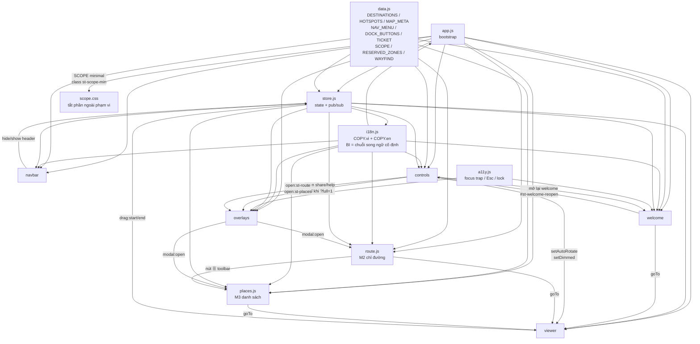

> Cập nhật: 2026-08-01 (v6 — thêm route.css/places.css + route.js/places.js · D-43)

# 01 — Architecture & Structure

## 1.1 Cây thư mục

```
suoitien-vr360redes/
├── CLAUDE.md                  # Rules — đọc trước khi sửa gì
├── index.html                 # Entry point duy nhất
├── docs/                      # ← bạn đang ở đây
│
├── css/
│   ├── tokens.css             # CSS custom properties: màu, font, spacing, z-index, easing
│   ├── base.css               # reset, html/body, typography, .st-sr-only, focus ring
│   ├── navbar.css             # #st-topbar, #st-navbar, #st-drawer
│   ├── viewer.css             # #st-viewer (mock panorama) + hint kéo xem
│   ├── controls.css           # #st-dock, #st-rail, #st-scene-label, #st-cta-ticket
│   ├── welcome.css            # #st-welcome + bản đồ SVG + hotspot + preview card
│   ├── overlays.css           # khung .st-modal + .st-fs (toàn màn hình) + share/help/toast
│   ├── route.css              # ⭐ M2 #st-route — overlay chỉ đường (clone · D-43)
│   ├── places.css             # ⭐ M3 #st-places — overlay danh sách điểm đến (clone · D-43)
│   ├── ticket.css             # ⭐ #st-ticket — thẻ vé combo (mask răng cưa, nudge 8s · D-41)
│   ├── responsive.css         # tất cả @media, mobile last (ghi đè)
│   └── scope.css              # ⭐ NẠP CUỐI — thu phạm vi về header + cụm C + welcome (D-39),
│                              #   ràng buộc vùng cấm cho cụm C (D-40), ghost ?zones=1
│
├── js/
│   ├── data.js                # DESTINATIONS, HOTSPOTS, MAP_META, WAYFIND, NAV_MENU (84 mục), DOCK_BUTTONS, TICKET
│   ├── i18n.js                # COPY.vi + COPY.en · ST.i18n.set/apply/t · quét [data-i18n]  (Q4)
│   ├── store.js               # State tập trung + pub/sub (không framework)
│   ├── viewer.js              # Mock 360 viewer: gradient/ảnh + drag để pan + API goTo()
│   ├── navbar.js              # Topbar, navbar, dropdown, #st-nav-peek, drawer mobile, switch VI/EN
│   ├── welcome.js             # Modal welcome: render hotspot, mini-card, morph FLIP ↔ nút
│   ├── controls.js            # Cụm C 2 nút + thẻ vé; popover ⋯ / CTA / label / hint tắt (D-39)
│   ├── overlays.js            # 1 engine mở-đóng chung cho MỌI modal (kể cả .st-fs-panel)
│   ├── route.js               # ⭐ M2: select, quãng đường + chỉ dẫn (MOCK ổn định), pin, zoom
│   ├── places.js              # ⭐ M3: tìm kiếm bỏ dấu, chip lọc làm-mờ, lưới thẻ
│   ├── a11y.js                # focus trap, Esc, scroll lock, aria-hidden — dùng cho mọi modal
│   └── app.js                 # Bootstrap: query param → set SCOPE → init theo thứ tự → mở welcome
│
├── assets/                    # (tuỳ chọn — chưa có file nào)
│   └── map/park-map-real.jpg  # Biến thể ?map=real. Chưa có → tự quay về bản đồ SVG + toast.
│
└── tools/                       # CÔNG CỤ DEV — không thuộc bản demo
    ├── check-icon-center.js     # Tâm khối của từng symbol (cô lập)
    ├── check-icon-rendered.js   # Pixel THẬT đã render trên trang — bắt lỗi do CSS
    └── fa-extract.js            # Trích outline 8 icon `i-fa-*` từ font gốc (D-36)
```

> `check-icon-*.js` cần `playwright` (`npm i -D playwright`); `fa-extract.js` chỉ dùng
> Node thuần. Đây là **công cụ dev**, bản demo vẫn là HTML/CSS/JS thuần không npm —
> RULE #3 không bị vi phạm.
> Chạy `node tools/check-icon-center.js` sau mỗi lần thêm/sửa path icon; exit `1` nếu lệch.
> `node tools/fa-extract.js` in ra 8 dòng `<g id="i-fa-…">` để dán đè vào sprite
> `#st-icons` — **đừng sửa tay** path của bộ `i-fa-*`, sửa xong sẽ lệch khỏi gốc.

### Vì sao KHÔNG có `assets/icons.svg` và `assets/map/park-map.svg` riêng

Cả **SVG sprite icon** và **bản đồ 2D** đều nằm **inline trong `index.html`**:

- `fetch()` / `` + `<use href="file.svg#id">` đều **bị CORS chặn khi mở
  `file://`** → khách double-click `index.html` sẽ thấy trang không có icon và không có bản đồ.
  Inline là cách duy nhất chạy được cả `file://` lẫn `http://`.
- Hotspot định vị bằng `%` của `#st-welcome-map`, nên bản đồ phải nằm **cùng cây DOM**
  với hotspot để dùng chung hệ toạ độ.

Logo lấy trực tiếp từ `suoitien.vn` (Q2 cho phép), có `onerror` → wordmark SVG.

> `overlays.js` **không** chứa overlay "Chỉ đường"/"Danh sách điểm đến" — 2 cái đó đã
> hoàn thiện trên site thật và nằm ngoài phạm vi prototype (D-09v2). Ở đây chỉ có
> panel giữ chỗ + toast giải thích.

## 1.2 Nguyên tắc kiến trúc

| Nguyên tắc | Lý do |
|---|---|
| **Không dependency ngoài** | Khách mở file là chạy, không cần mạng. Không CDN, không npm. |
| **Prefix `st-` cho mọi id/class** | Bản thật sẽ nhúng chung window với 3DVista + React DC component. Không được đụng CSS của họ. |
| **1 file CSS = 1 vùng UI** | Sửa navbar không cần mở file khác. Ghép ngược vào repo thật cũng dễ tách. |
| **State tập trung ở `store.js`** | Không truyền biến lung tung giữa module. Modal nào cũng đọc/ghi 1 chỗ. |
| **`a11y.js` dùng chung cho mọi modal** | Focus trap + Esc + scroll lock viết 1 lần. Xem [`04-modals.md`](04-modals.md) §4.2. |
| **Mọi mock đánh dấu `// MOCK:`** | Dev port sang bản thật chỉ cần grep `MOCK:` là ra hết chỗ cần nối API. |
| **Không `!important`** trừ khi ghi đè 3DVista | Trong prototype không có 3DVista nên không cần. Bản thật thì cần (xem [`07-integration.md`](07-integration.md)). |

## 1.3 Thứ tự load trong `index.html`

Thứ tự **quan trọng** — `tokens.css` phải trước mọi CSS khác, `scope.css` phải **sau
cùng**, `data.js` phải trước mọi JS khác, `app.js` phải cuối cùng.

> Vì sao `scope.css` phải nạp cuối: nó ghi đè các rule bố cục của `responsive.css`
> (vốn giả định dock nằm giữa và kéo ngang được). Cùng specificity thì thắng nhờ thứ
> tự; đổi chỗ là cụm C quay lại dàn ngang và đè lên cụm ⓓ của trip360 — xem D-40.

```html
<head>
  <!-- 1. Font: @font-face local, không gọi Google Fonts -->
  <!-- 2. CSS theo đúng thứ tự cascade -->
  tokens.css → base.css → navbar.css → viewer.css → controls.css
            → welcome.css → overlays.css → route.css → places.css
            → ticket.css → responsive.css → scope.css
</head>
<body>
  <!-- 3. SVG sprite inline (ẩn) — phải có trước khi component render icon -->
  <svg id="st-icons" hidden>…</svg>

  <!-- 4. Markup shell: các container rỗng, JS sẽ render vào -->
  #st-viewer · #st-topbar · #st-navbar · #st-scene-label
  #st-dock · #st-ticket-wrap · #st-welcome · #st-route · #st-places
  · #st-share · #st-help · #st-existing · #st-drawer · #st-toast

  <!-- 5. JS theo thứ tự phụ thuộc -->
  data.js → i18n.js → store.js → a11y.js → viewer.js → navbar.js
         → controls.js → overlays.js → route.js → places.js → welcome.js → app.js
</body>
```

Tất cả `<script>` là **classic script** (không `type="module"`) → biến global,
không cần server, mở `file://` chạy được. Mỗi file bọc trong IIFE, chỉ expose 1
namespace: `ST.data`, `ST.store`, `ST.a11y`, `ST.viewer`, `ST.navbar`,
`ST.controls`, `ST.overlays`, `ST.route`, `ST.places`, `ST.welcome`.

> `route.js` / `places.js` phải nạp **sau** `overlays.js`: chúng đăng ký listener
> `modal:open` / `lang:change` chứ không tự quản vòng đời.

## 1.4 Mock VR360 viewer — `js/viewer.js`

Prototype không có panorama thật. `#st-viewer` mô phỏng bằng:

1. **Nền**: `background-image` là ảnh rộng (hoặc CSS gradient nếu chưa có ảnh),
   `background-size: cover`, đặt `background-position-x` theo yaw.
2. **Drag để pan**: pointerdown/move/up → cộng dồn vào `yaw`, ghi vào
   `--st-yaw` → nền dịch ngang. Có inertia nhẹ (`requestAnimationFrame`, damping 0.92).
3. **Auto-rotate**: `rAF` tăng yaw 0.02°/frame, tự tắt khi user drag.
4. **Chuyển scene**: `goTo(key)` → fade trắng 250ms → đổi nền + label → fade in.
   Đây là chỗ bản thật gọi `VRCore.navigateToPano()`.
5. **API expose**: `ST.viewer.goTo(key)`, `.getCurrent()`, `.setAutoRotate(bool)`,
   `.setDimmed(bool)` (làm mờ khi modal mở).

```js
// MOCK: bản thật thay bằng VRCore.navigateToPano(tour, dest.pano)
ST.viewer.goTo = function (key) { … }
```

## 1.5 Bảng z-index (nguồn duy nhất: `tokens.css`)

Prototype dùng thang **thấp** (0–90). Bản thật phải dịch lên >10000 vì 3DVista
và `floorplan.css` đã chiếm 10000–10009 — xem [`07-integration.md`](07-integration.md) §7.4.

| Token | Giá trị | Dùng cho |
|---|---|---|
| `--st-z-viewer` | `0` | `#st-viewer` |
| `--st-z-hint` | `5` | Hint "kéo để xem 360°" |
| `--st-z-scene-label` | `10` | `#st-scene-label` tên điểm hiện tại |
| `--st-z-dock` | `20` | `#st-dock` thanh nút chính |
| `--st-z-rail` | `20` | `#st-rail` nút phụ bên phải |
| `--st-z-navbar` | `40` | `#st-topbar` + `#st-navbar` |
| `--st-z-dropdown` | `45` | Dropdown của navbar |
| `--st-z-overlay` | `60` | `#st-directions`, `#st-places` (overlay toàn màn) |
| `--st-z-modal` | `70` | `#st-welcome`, `#st-share`, `#st-help` |
| `--st-z-drawer` | `75` | `#st-drawer` menu mobile |
| `--st-z-toast` | `85` | `#st-toast` |
| `--st-z-debug` | `90` | Panel `?debug=1` |

> Quy tắc: **không hardcode z-index ở bất kỳ file CSS nào khác.** Thêm layer mới
> thì thêm token vào `tokens.css` và thêm 1 dòng vào bảng này.

## 1.6 Sơ đồ phụ thuộc module



> ⚠️ `welcome ↔ controls` là **cặp 2 chiều duy nhất** được phép — do animation morph
> (§4.3.8 của [`04-modals.md`](04-modals.md)) cần cả 2 biết rect của nhau. Cài đặt qua
> event trên `store`, không gọi hàm trực tiếp, để không tạo phụ thuộc cứng.

Quy tắc phụ thuộc: **mũi tên không được tạo vòng.** `viewer.js` không bao giờ
gọi lên `welcome.js`/`overlays.js`; nó chỉ phát event qua `store`.

## 1.7 File nào sửa khi muốn đổi gì

| Muốn đổi | Sửa file |
|---|---|
| Màu / font / spacing / radius / shadow | `css/tokens.css` — **chỉ** file này |
| Tên điểm, danh sách hotspot, toạ độ hotspot | `js/data.js` |
| Chữ trên UI (tiêu đề modal, label nút, toast) | `js/data.js` → object `COPY` |
| Menu navbar, dropdown | `js/data.js` → `NAV_MENU` |
| Thêm nút vào dock | `js/data.js` → `DOCK_BUTTONS` + `js/controls.js` handler |
| Thêm modal mới | `js/overlays.js` (dùng engine chung) + `css/overlays.css` + docs `04-modals.md` |
| Layout mobile | `css/responsive.css` |
| Thứ tự / điều kiện hiện modal welcome | `js/app.js` |
