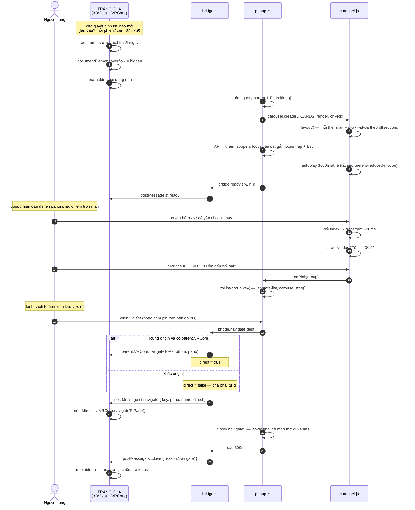
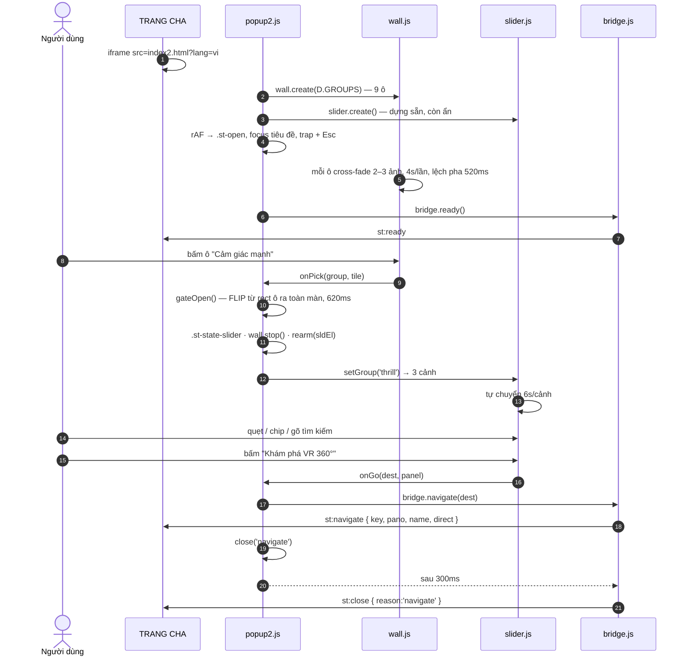

> Cập nhật: 2026-08-03 (v8 — bản 1 thêm tầng danh sách; §5.10 bản đồ · D-51/D-52)

# 05 — Flows & Logic

> §5.1–5.8 tả **bản 1** (`index.html`). Luồng của **bản 2** (`index2.html` — 2 tầng)
> ở §5.9; chi tiết đầy đủ: [`09-variant2.md`](09-variant2.md).

## 5.1 Luồng chính — từ lúc trang cha nhúng iframe đến lúc đổi cảnh



**Ba việc chạy song song ở cuối:** animation đóng của popup · điều hướng tour của
3DVista · gỡ iframe. Đó là lý do `st:close` đến **sau** `st:navigate` 300 ms — nếu bắn
cùng lúc thì cha gỡ iframe ngay và popup biến mất cụp một cái.

## 5.2 Bốn đường đóng popup

| Cách | `reason` | Ghi chú |
|---|---|---|
| Bấm 1 điểm (danh sách hoặc pin bản đồ) | `'navigate'` | Kèm `st:navigate` trước đó |
| Nút `×` hoặc "Để tôi tự khám phá" | `'button'` | |
| `Esc` **khi focus đang trong iframe** | `'esc'` | Chỉ đóng khi đang ở `deck` và bản đồ đã đóng — xem §5.10. Focus ở ngoài iframe thì trang cha phải tự bắt ([`07`](07-integration.md) §7.3) |
| Nút "Mở lại" trong `?debug=1` | `'debug'` | |
| ~~Bấm ra ngoài~~ | — | **Cố ý không có** (D-14): onboarding, click nhầm là mất. Từ D-48 cũng không còn "ngoài" để mà bấm — popup chiếm trọn màn |

Guard: `closing = true` chặn double-click và chặn `close()` chạy 2 lần.

## 5.3 Mở lại mà không reload iframe

Trang cha có 2 lựa chọn khi muốn hiện popup lần nữa:

| Cách | Khi nào dùng |
|---|---|
| `frame.hidden = false` + `postMessage st:open` | **Nên dùng.** Iframe đã tải sẵn, ảnh đã cache → hiện tức thì |
| Tạo iframe mới | Khi muốn đổi `?lang=` bằng URL thay vì postMessage, hoặc muốn reset sạch |

`st:open` làm: bỏ `.st-closing` → gỡ `.st-going` còn sót → `carousel.go(0)` →
một frame sau thêm lại `.st-open` để animation vào màn chạy lại.

> Nhịp "bỏ class một frame rồi gắn lại" là bắt buộc: CSS animation chỉ khởi động khi
> class được **thêm**. Giữ nguyên `.st-open` thì `st-fade-up` không chạy lại.

## 5.4 Ngôn ngữ

```
Nhúng:   index.html?lang=en          → i18n.init('en')
Đổi nóng: postMessage st:lang        → i18n.set(lang) → listeners → applyLang()
                                         ├─ applyTitle()      (biến thể a/b/c)
                                         ├─ i18n.apply()      (quét [data-i18n])
                                         ├─ carousel.rerender() (12 thẻ, GIỮ index)
                                         └─ labelAll()        (aria-label từng thẻ)
```

Popup **không** có nút chuyển ngôn ngữ và **không** đọc `localStorage`. Trong iframe,
`localStorage` thuộc origin của popup chứ không phải của trang cha → nếu popup tự nhớ,
nó sẽ ghi đè lên cái cha vừa truyền vào, và user thấy hai chỗ trên màn hình nói hai
thứ tiếng.

`rerender()` giữ nguyên `index` đang xem — đổi ngôn ngữ mà carousel nhảy về thẻ 1 thì
người dùng mất chỗ đang đọc.

## 5.5 Tracking

`ST.track()` chỉ `console.log` khi `?debug=1`. Có **hai** đường nối vào bản thật, chọn
một:

| Đường | Cách | Khi nào chọn |
|---|---|---|
| **Trang cha ghi** | Cha đã nhận `st:navigate` / `st:close` rồi — ghi luôn ở đó | Đơn giản nhất, không phải sửa popup |
| **Popup tự ghi** | Sửa `ST.track` trong `popup.js` gọi `VR360Track.event()` | Khi muốn cả những event cha không thấy (`popup_card_view`) |

| Event | Payload | Trả lời câu hỏi gì |
|---|---|---|
| `popup_shown` | — | Bao nhiêu % user thấy popup |
| `popup_card_view` | `{ key }` | Thẻ nào thực sự trôi qua trước mắt user |
| `popup_go` | `{ key, dwellMs }` | Tỉ lệ convert, và mất bao lâu để chọn |
| `popup_close` | `{ reason, dwellMs }` | `reason: 'button'` vs `'navigate'` = **thước đo popup có hiệu quả không** |

→ Tỉ lệ `reason:'button'` / `reason:'navigate'` chính là con số đáng bàn với khách.

## 5.6 Responsive — JS lo gì, CSS lo gì

| Thứ | Ai lo | Cách |
|---|---|---|
| Thẻ carousel nhỏ lại | `responsive.css` | ghi đè biến `--st-card-*` |
| Footer đảo chiều + nút skip thành pill | `responsive.css` | `flex-direction: column-reverse` |
| Ẩn eyebrow + subtitle ở landscape thấp | `responsive.css` | `display: none` |
| Số thẻ hiện | **`js/popup.js`** | `visible: 1` truyền vào `carousel.create()` — thứ duy nhất về bố cục do JS quyết |

**`js/popup.js` không có một dòng `matchMedia` nào.** Đây là kết quả trực tiếp của
D-44: bản đồ cũ buộc JS phải đổi `viewBox` và đổi bộ toạ độ hotspot theo breakpoint,
còn carousel thì mọi khác biệt mobile đều diễn đạt được bằng CSS thuần.

> Media query đo **kích thước iframe**, không phải trang cha. Iframe được nhúng phủ
> kín viewport nên hai con số thường bằng nhau — nhưng nếu bên tích hợp cho iframe
> kích thước khác thì breakpoint đi theo iframe.

## 5.7 Xử lý lỗi & trường hợp biên

| Tình huống | Popup làm gì |
|---|---|
| Mở thẳng `index.html` (không iframe) | `bridge.embedded()` = false → mọi lời gọi ra ngoài thành no-op, popup vẫn chạy đủ để xem thiết kế |
| Khác origin với trang cha | `sameOrigin()` = false → bỏ qua đường VRCore, chỉ `postMessage`. `direct: false` báo cho cha biết |
| `parent.VRCore` không tồn tại | Như trên |
| `postMessage` ném lỗi | `try/catch`, log khi `?debug=1`, popup vẫn đóng bình thường |
| Ảnh thẻ 404 | Thẻ hiện nền xám `--st-n-200` + chữ vẫn đọc được (veil + body nằm trên nền, không phụ thuộc ảnh) |
| `prefers-reduced-motion` | Autoplay **tắt hẳn**; transition/animation về `.01ms` (`base.css`); nút ‹ › và phím vẫn chạy |
| Tab bị ẩn | `document.hidden` → autoplay tạm dừng, không đốt CPU vẽ transform dưới nền |
| Bấm thẻ 2 lần thật nhanh | Guard `closing` → lần thứ 2 return ngay |

## 5.8 Bootstrap `popup.js` — thứ tự đầy đủ

```
DOMContentLoaded (hoặc chạy ngay nếu document đã sẵn sàng)
  1. lấy tham chiếu DOM: #st-popup, .st-popup-inner, #st-popup-deck, #st-popup-title
  2. i18n.init(?lang)            ← trước mọi thứ sinh chữ
  3. đọc ?title=a|b|c
  4. carousel.create()            ← sinh 12 thẻ vào DOM
  5. applyTitle() + i18n.apply() + labelAll()
  6. bind [data-st-close] (1 listener trên document)
  7. bridge.on('lang') · bridge.on('open') · i18n.onChange(applyLang)
  8. rAF → .st-open · carousel.start() · focus tiêu đề · trap + Esc
  9. bridge.ready({ w, h })  ← đo .st-popup-inner SAU khi đã có nội dung
 10. ?debug=1 → initDebug()
```

Bước 4 phải trước bước 5: `labelAll()` quét `.st-cr-card` trong DOM, chưa có thẻ thì
không gán được `aria-label`.

Bước 8 dùng `requestAnimationFrame` chứ không gắn `.st-open` ngay: gắn trong cùng
frame với lúc chèn DOM thì trình duyệt gộp hai trạng thái làm một và transition không
chạy — popup hiện ra cứng đơ.

---

## 5.9 Luồng của BẢN 2 — `index2.html` (D-50)

Bản 2 thêm **một tầng** giữa "mở popup" và "đi VR":



### Khác bản 1 ở đâu

| | Bản 1 | Bản 2 |
|---|---|---|
| Bấm ô/thẻ | `bridge.navigate()` **ngay** | Mở slider của khu vực |
| Bấm ô rìa | Đi VR | **Đưa vào giữa** |
| Đi VR | Bấm thẻ | Nút **"Khám phá VR 360°"** |
| Esc | Đóng popup | Ở slider → **về wall**; ở wall → đóng |
| `st:open` | Về thẻ 1 | **Luôn về wall** |

### Ba đường vào slider

| Từ | Nhóm mở ra |
|---|---|
| Bấm 1 trong 9 ô | nhóm của ô đó |
| Nút "Bắt đầu hành trình" | `noibat` (5 điểm ai cũng ghé) |
| Nút "Tìm địa điểm" | `all`, focus thẳng vào ô tìm kiếm |

Hai nút sau gọi `toSlider(group, null)` — `tile` là `null` nên bỏ qua FLIP "mở cổng"
(không có ô nào để phóng ra từ đó), chỉ cross-fade.

### Bẫy Tab phải đổi theo trạng thái

`rearm()` gỡ trap cũ rồi gắn lại mỗi lần đổi trạng thái. Không làm thì Tab vẫn chạy
vòng trong 9 ô của wall trong khi mắt đang nhìn slider.

---

## 5.10 Bản đồ 2D — luồng dùng chung cả 2 bản (D-51)

```
Bản 1                                  Bản 2
─────────────────────────────────      ─────────────────────────────────
footer "Xem trên bản đồ 2D"            thanh wall "Xem trên bản đồ 2D"
  → openMap('all')                       → openMap('all')
  → 20 pin                               → 20 pin

danh sách → "Xem khu vực này…"         slider → "Xem khu vực này…"
  → openMap('area')                      → openMap('area')
  → currentKeys()                        → D.group(slider.group()).keys
    (khu vực HOẶC kết quả tìm kiếm)
```

Cả hai gọi cùng `ST.map2d.open(keys, label)`. Component không biết mình đang được gọi
từ bản nào.

### Trong bản đồ

```
bấm pin        → thẻ chi tiết (ảnh · số hiệu · tên · blurb · "Xem ảnh 360°")
                 nếu pin nằm khuất sau thẻ → kéo bản đồ lên cho lộ ra
bấm "Xem 360°" → opts.onGo(dest) → goVR() → bridge.navigate() → đóng cả popup
bấm nền        → đóng thẻ chi tiết
kéo / cuộn     → pan / zoom, giới hạn [contain, cover × 4.5]
"Toàn cảnh"    → contain; bấm lần 2 → về cover
Esc            → chỉ đóng bản đồ, KHÔNG đóng popup
```

### Esc ba tầng

| Đang ở | Esc làm gì |
|---|---|
| Bản đồ mở | Đóng bản đồ |
| Danh sách / slider | Về carousel / wall |
| Carousel / wall | `close('esc')` → `st:close` |

Cùng nguyên tắc ở cả hai bản: **đi ngược đúng đường đã vào**.

### Cỡ pin đổi theo zoom

`apply()` ghi 2 biến lên `.st-map-canvas` mỗi khung hình:

| Biến | Công thức | Để làm gì |
|---|---|---|
| `--k` | tỉ lệ zoom | Pin chia cho nó → không bị bản đồ phóng theo |
| `--pin` | `clamp(2400·k / 1300, .45, 1)` | Pin nhân với nó → nhỏ lại khi bản đồ thu nhỏ |

Không có `--pin` thì ở mức "Toàn cảnh" trên máy dọc, 20 pin cỡ 38px chồng thành một
đống. Đo được: có `--pin` thì pin còn 17px ở mức đó.
