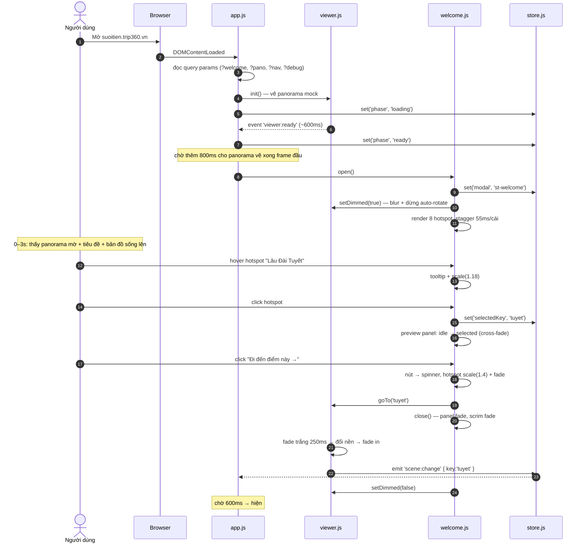
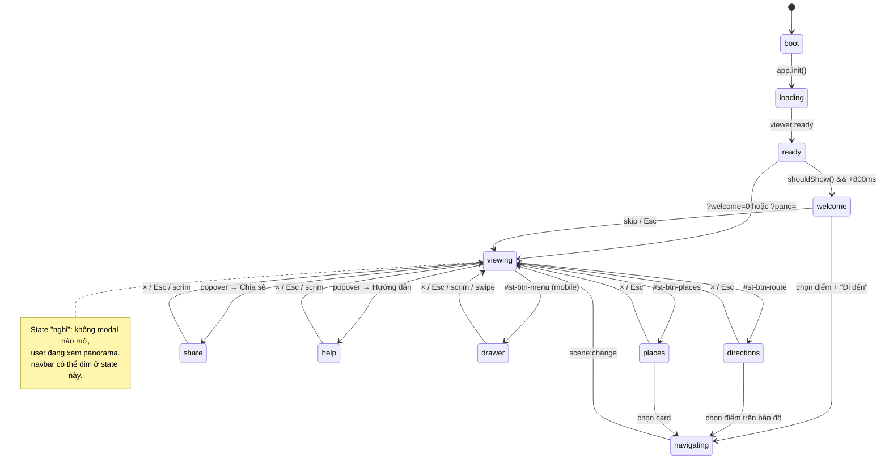
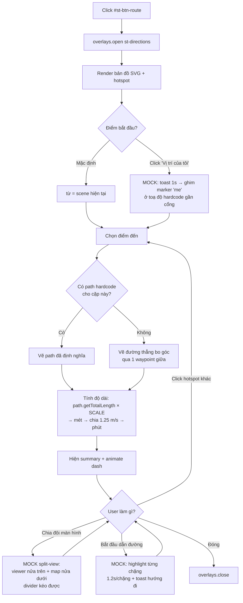
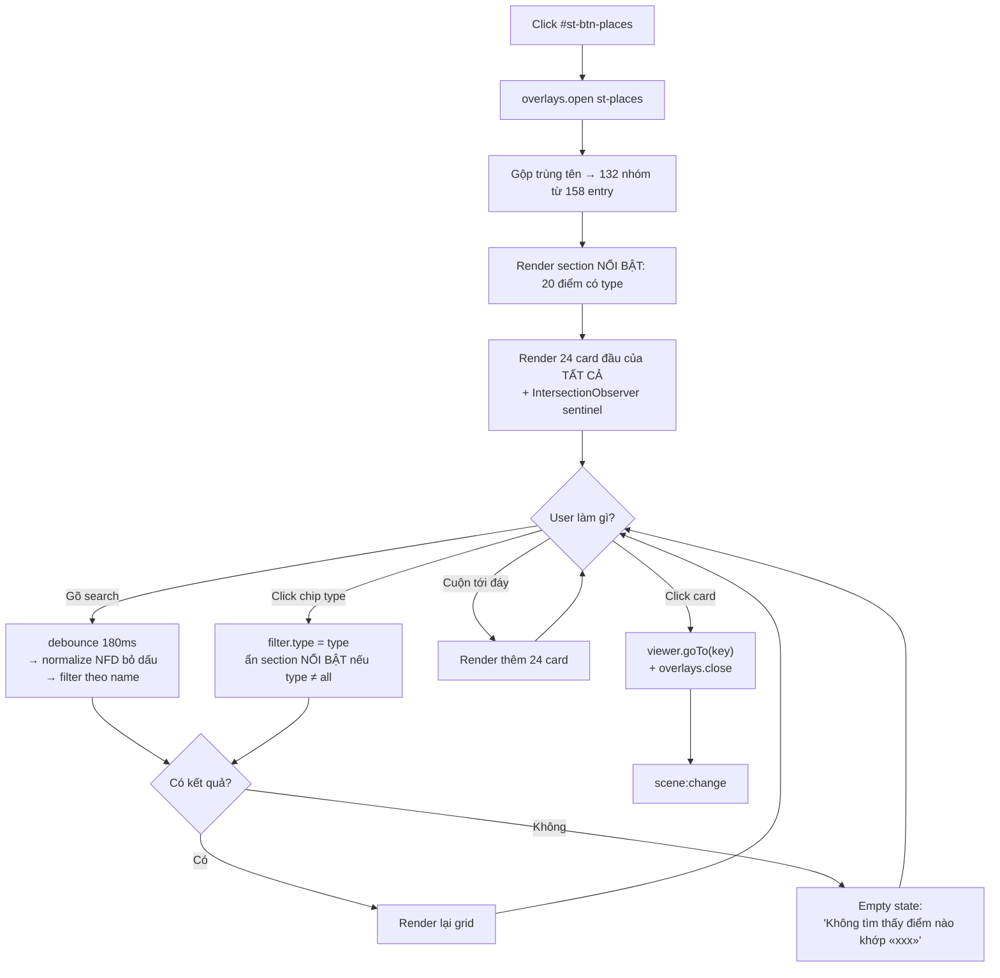
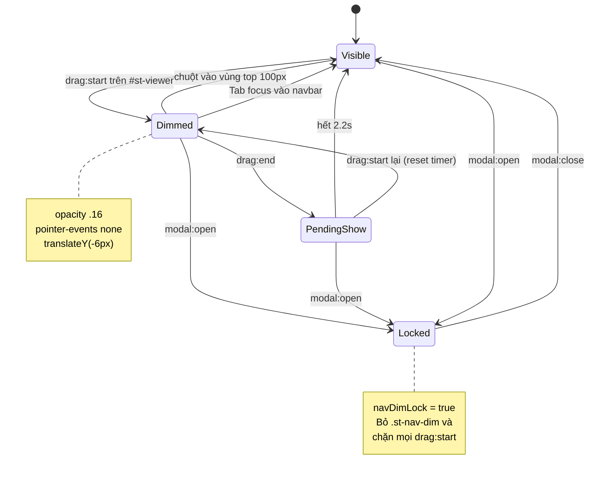
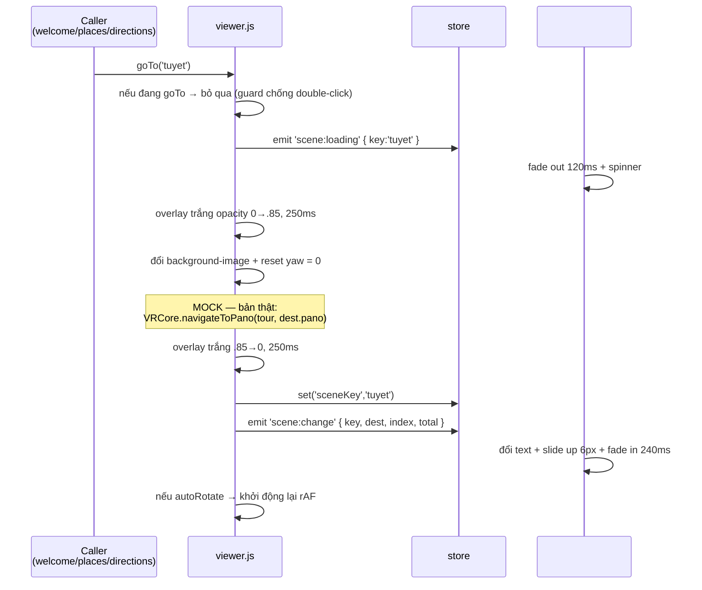

> Cập nhật: 2026-07-30

# 05 — Flows & Logic

## 5.1 Luồng chính — "3 giây đầu" (YC-1)

Đây là luồng quan trọng nhất, mục tiêu là gây ấn tượng + giải thích tour.



### Nhánh rẽ

| Nhánh | Điều kiện | Kết quả |
|---|---|---|
| Bỏ qua | Click `#st-welcome-skip` hoặc Esc | Đóng modal, viewer ở `defaultPano`, hiện hint |
| Deep link | `?pano=tuyet` | Không mở welcome, vào thẳng điểm đó |
| Tắt welcome | `?welcome=0` | Không mở welcome |
| Chưa chọn mà bấm "Đi đến" | Không thể — nút disabled ở state idle | — |
| `prefers-reduced-motion` | Hệ thống user | Bỏ stagger + spring, chỉ fade nhanh |

## 5.2 State machine — `store.js`

### Shape của state

```js
ST.store.state = {
  phase:       'boot' | 'loading' | 'ready',   // vòng đời app
  modal:       null | 'st-welcome' | 'st-directions' | 'st-places'
                    | 'st-share' | 'st-help' | 'st-drawer',
  popover:     null | 'st-more-popover' | 'st-nav-dd-<i>',
  sceneKey:    'cong',           // key trong DESTINATIONS, điểm đang xem
  selectedKey: null,             // điểm đang chọn trong welcome/places (chưa đi)
  navDimmed:   false,            // navbar đang mờ vì user kéo panorama
  navDimLock:  false,            // khoá không cho dim (khi có modal mở)
  autoRotate:  false,
  soundOn:     false,
  fullscreen:  false,
  lang:        'vi',
  filter:      { type: 'all', q: '' },   // của #st-places
  yaw:         0,                // góc xoay mock viewer
  isDragging:  false
};
```

### API

```js
ST.store.get(key)
ST.store.set(key, value)          // chỉ emit nếu giá trị THỰC SỰ đổi
ST.store.patch({ a:1, b:2 })      // set nhiều key, emit 1 lần
ST.store.on(event, fn)            // trả về off()
ST.store.emit(event, payload)
```

### Event bus

| Event | Payload | Ai phát | Ai nghe |
|---|---|---|---|
| `viewer:ready` | — | viewer.js | app.js |
| `scene:change` | `{ key, dest, index, total }` | viewer.js | scene-label, share, tracking |
| `scene:loading` | `{ key }` | viewer.js | scene-label (spinner) |
| `modal:open` | `{ id }` | overlays.js | navbar (lock dim), viewer (dim) |
| `modal:close` | `{ id }` | overlays.js | navbar (unlock), viewer (undim) |
| `drag:start` | — | viewer.js | navbar (dim), hint (ẩn) |
| `drag:end` | — | viewer.js | navbar (hẹn undim 2.2s) |
| `filter:change` | `{ type, q }` | overlays.js | places grid |
| `toggle:change` | `{ name, value }` | controls.js | viewer, dock button state |

### Sơ đồ chuyển state của `modal`



## 5.3 Luồng "Chỉ đường" (M2)



`SCALE`: hardcode sao cho `park-map.svg` full width ≈ 900 m (kích thước thực tế
ước lượng của công viên). `// MOCK:` — bản thật lấy từ `map_geo.json`.

## 5.4 Luồng "Điểm đến" (M3)



### Logic gộp tên trùng

```js
// catalog.json có 'caubachtuong', 'caubachtuong2', 'caubachtuong3', 'caubachtuong4'
// → tất cả name = "Cầu Bạch Tượng"
// Gộp thành 1 group:
{
  key: 'caubachtuong',           // key của entry đầu tiên
  name: 'Cầu Bạch Tượng',
  views: ['caubachtuong', 'caubachtuong2', 'caubachtuong3', 'caubachtuong4'],
  viewCount: 4                   // → badge "4 góc nhìn"
}
```

Click card → mở `views[0]`. Trong panorama, nút "Góc nhìn khác →" chuyển vòng
qua `views` (v2).

## 5.5 Luồng navbar auto-dim



**Vì sao có `Locked`:** nếu modal mở mà navbar vẫn dim được thì user kéo bản đồ
trong modal → drag event bubble → navbar dim → nhìn như bug.

## 5.6 Luồng chuyển scene — `viewer.goTo()`



**Guard chống double-click:** biến `_navigating` — nếu đang true thì `goTo()`
return ngay. Bắt buộc, không thì user click nhanh 2 hotspot → 2 fade chồng nhau.

## 5.7 Luồng bootstrap `app.js` — thứ tự đầy đủ

```
1.  Parse query: welcome, pano, nav, debug
2.  store.set('phase', 'loading')
3.  ST.a11y.init()          — bind Esc global, chuẩn bị scroll lock
4.  ST.viewer.init('#st-viewer')
5.  ST.navbar.init()        — render topbar + navbar + drawer từ NAV_MENU
6.  ST.controls.init()      — render dock từ DOCK_BUTTONS + popover
7.  ST.overlays.init()      — bind [data-st-close], đăng ký M2–M6, P1
8.  ST.welcome.init()       — chỉ render markup, CHƯA mở
9.  Nếu ?nav=off  → document.documentElement.classList.add('st-no-nav')
10. Nếu ?debug=1  → ST.debug.init()
11. Đợi event 'viewer:ready'
12. store.set('phase', 'ready')
13. Quyết định mở welcome:
      ?pano=<key>   → viewer.goTo(key); KHÔNG mở welcome
      ?welcome=0    → KHÔNG mở
      ?welcome=1    → setTimeout(800) → welcome.open()
      shouldShow()  → setTimeout(800) → welcome.open()
      else          → không mở
14. Nếu welcome KHÔNG mở → setTimeout(600) → hint.show()
```

**Vì sao init trước rồi mới mở:** nếu welcome mở trước khi `overlays.init()` chạy
thì `[data-st-close]` chưa bind → nút × không hoạt động. Đây là lỗi rất dễ mắc.

## 5.8 Logic responsive — quyết định ở đâu

| Quyết định | Nơi xử lý | Cơ chế |
|---|---|---|
| Ẩn topbar | `responsive.css` | `@media (max-width: 599px) { display: none }` |
| Navbar → hamburger | `responsive.css` + `navbar.js` | CSS ẩn list, JS chỉ render drawer khi cần |
| Dock cuộn ngang | `responsive.css` | `overflow-x: auto` |
| Welcome fullscreen | `responsive.css` | `inset: 0; border-radius: 0` |
| Preview slide-up mobile | `welcome.css` + `welcome.js` | class `.st-preview-sheet`, JS thêm khi `matchMedia('(max-width:599px)')` |
| Grid places 2 cột | `responsive.css` | `minmax(150px, 1fr)` |
| Bản đồ portrait | `welcome.js` | Đổi `viewBox` sang `0 0 640 800` + dùng bộ toạ độ `xyMobile` |

Nguyên tắc: **CSS lo layout, JS chỉ lo cái CSS không làm được** (đổi viewBox,
đổi bộ toạ độ hotspot). JS dùng `matchMedia` + listener `change`, không dùng
`resize` + đo `innerWidth`.

## 5.9 Luồng tracking (mock, giữ chỗ)

Site thật có `js/vr360-tracking.js` → `POST /backend/analytics/track.php`.
Prototype **không gửi request** nhưng vẫn gọi qua 1 hàm giữ chỗ để bản thật chỉ
cần nối vào:

```js
// MOCK: chỉ console.log. Bản thật: VR360Track.event(name, payload)
ST.track = function (name, payload) {
  if (ST.store.get('debug')) console.log('[track]', name, payload);
};
```

Event nên gửi (đề xuất cho khách — có giá trị kinh doanh):

| Event | Payload | Trả lời câu hỏi gì |
|---|---|---|
| `welcome_shown` | `{ ts }` | Bao nhiêu % user thấy modal |
| `welcome_hotspot_hover` | `{ key }` | Điểm nào hút mắt nhất |
| `welcome_hotspot_click` | `{ key }` | Điểm nào được chọn |
| `welcome_go` | `{ key, dwellMs }` | Tỉ lệ convert của modal, và mất bao lâu để chọn |
| `welcome_skip` | `{ dwellMs }` | Tỉ lệ bỏ qua |
| `scene_view` | `{ key, fromKey }` | Đường đi phổ biến trong tour |
| `places_search` | `{ q, resultCount }` | User tìm gì không có |
| `dock_click` | `{ id }` | Nút nào thực sự được dùng |
| `ticket_cta_click` | `{ fromScene }` | Điểm nào dẫn tới ý định mua vé |

→ `welcome_skip` vs `welcome_go` chính là **thước đo modal welcome có hiệu quả
hay không**. Nên bàn với khách để bật tracking này ở bản thật.

## 5.10 Xử lý lỗi

| Tình huống | Xử lý |
|---|---|
| `?pano=<key>` không tồn tại | Toast "Không tìm thấy điểm «xxx»" → về `defaultPano`, vẫn mở welcome |
| Ảnh nền viewer lỗi 404 | Fallback CSS gradient theo `icon` của điểm, không để trắng trơn |
| `backdrop-filter` không hỗ trợ | `@supports not` → tăng alpha nền lên `.88` |
| `navigator.clipboard` không có | Fallback `document.execCommand('copy')` → nếu vẫn fail thì select text + toast "Nhấn Ctrl+C" |
| Fullscreen API bị chặn | Toast "Trình duyệt không cho phép toàn màn hình" |
| `localStorage` bị chặn (private mode) | try/catch, fallback biến in-memory |
| `prefers-reduced-motion` | Tắt stagger, spring, pulse, dash animation |
| JS lỗi khi bootstrap | try/catch quanh mỗi `init()` → 1 module lỗi không làm chết cả app; log ra console |
